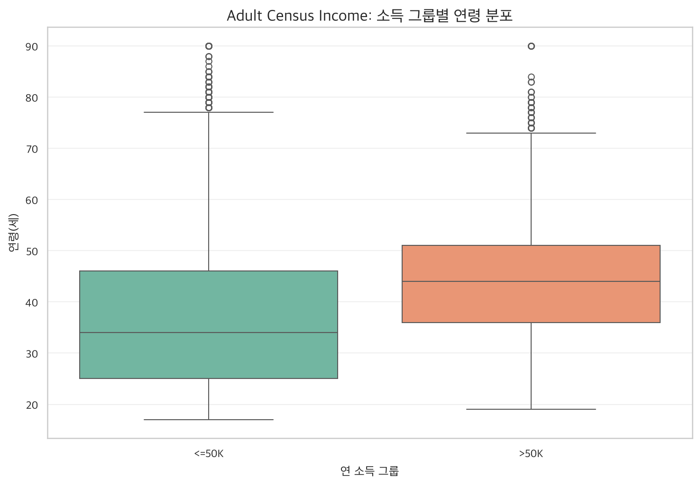

# Adult Census Income 종합 분석 보고서

- 작성일: 2026-07-21
- 작성자: 광주 3반 한형준
- 데이터 출처: [UCI Machine Learning Repository - Adult](https://archive.ics.uci.edu/ml/machine-learning-databases/adult/adult.data)
- 분석 목표: 연 소득이 50K를 초과하는지 예측하는 이진 분류

## 1. 데이터 준비 및 Pandas·Polars 비교

- 원본 데이터: 32,561행 × 15열
- Pandas 로딩 결과: (32561, 15)
- Polars 로딩 결과: (32561, 15)
- 발견한 중복 행: 24건
- 중복 제거 후 데이터: 32,537행
- 결측치 처리: `?`를 null로 변환한 후 범주형 열의 최빈값으로 대체
- 처리 후 결측치: Pandas 0건, Polars 0건

### 처리 전 결측치

| column | missing_count |
| --- | --- |
| workclass | 1836 |
| occupation | 1843 |
| native-country | 583 |

## 2. 기술통계

평균·표준편차와 25%·50%·75% 분위수를 산출했습니다.

| variable | mean | std | 25% | 50% | 75% |
| --- | --- | --- | --- | --- | --- |
| age | 38.586 | 13.638 | 28.000 | 37.000 | 48.000 |
| fnlwgt | 189780.849 | 105556.471 | 117827.000 | 178356.000 | 236993.000 |
| education-num | 10.082 | 2.572 | 9.000 | 10.000 | 12.000 |
| capital-gain | 1078.444 | 7387.957 | 0.000 | 0.000 | 0.000 |
| capital-loss | 87.368 | 403.102 | 0.000 | 0.000 | 0.000 |
| hours-per-week | 40.440 | 12.347 | 40.000 | 40.000 | 45.000 |

## 3. 수치형 변수 상관계수

| variable | age | fnlwgt | education-num | capital-gain | capital-loss | hours-per-week |
| --- | --- | --- | --- | --- | --- | --- |
| age | 1.000 | -0.076 | 0.036 | 0.078 | 0.058 | 0.069 |
| fnlwgt | -0.076 | 1.000 | -0.043 | 0.000 | -0.010 | -0.019 |
| education-num | 0.036 | -0.043 | 1.000 | 0.123 | 0.080 | 0.148 |
| capital-gain | 0.078 | 0.000 | 0.123 | 1.000 | -0.032 | 0.078 |
| capital-loss | 0.058 | -0.010 | 0.080 | -0.032 | 1.000 | 0.054 |
| hours-per-week | 0.069 | -0.019 | 0.148 | 0.078 | 0.054 | 1.000 |

상관계수는 선형 관계의 방향과 강도를 나타내며, 인과관계를 의미하지 않습니다.

## 4. 시각화

### Seaborn 정적 차트

소득 그룹별 연령 분포를 박스플롯으로 비교했습니다.

### Plotly 인터랙티브 차트

교육 수준별 고소득자 비율과 표본 수·주당 평균 근무시간을 확인할 수 있습니다.

[인터랙티브 차트 열기](adult_income_plotly.html)

## 5. 독립표본 t-test

- 검정 대상: `<=50K`와 `>50K` 소득 그룹의 평균 연령
- t 통계량: -50.2350
- p-value: < 1e-300
- 유의수준: 0.05
- 해석: p-value < 0.05이므로 귀무가설을 기각합니다. 두 소득 그룹의 평균 연령에는 통계적으로 유의한 차이가 있습니다.

## 6. ML Pipeline 및 평가

수치형 열에는 중앙값 대체와 표준화를, 범주형 열에는 최빈값 대체와 원-핫 인코딩을 적용했습니다.
이 전처리와 LogisticRegression을 하나의 sklearn `Pipeline` 객체로 구성했습니다.

| 평가 지표 | 값 |
| --- | ---: |
| Accuracy | 0.8090 |
| Precision | 0.5684 |
| Recall | 0.8610 |
| F1 score | 0.6848 |

- 학습 데이터: 26,029행
- 평가 데이터: 6,508행
- Confusion Matrix: `[[3915, 1025], [218, 1350]]`
- 저장 모델: [adult_income_pipeline.joblib](adult_income_pipeline.joblib)

## 7. 발표 요약

1. Pandas와 Polars는 동일한 32,561행·15열을 로딩했으며 결측치·중복 처리 결과도 일치했습니다.
2. 연령 분포와 교육 수준별 고소득 비율을 정적·인터랙티브 차트로 비교했습니다.
3. t-test로 두 소득 그룹의 평균 연령 차이에 대한 통계적 유의성을 확인했습니다.
4. 전처리와 분류기를 Pipeline으로 묶어 재현 가능한 모델 파일로 저장했습니다.
