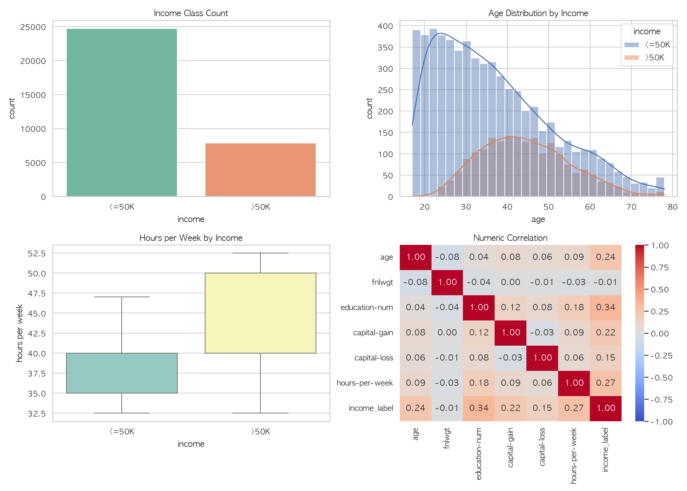
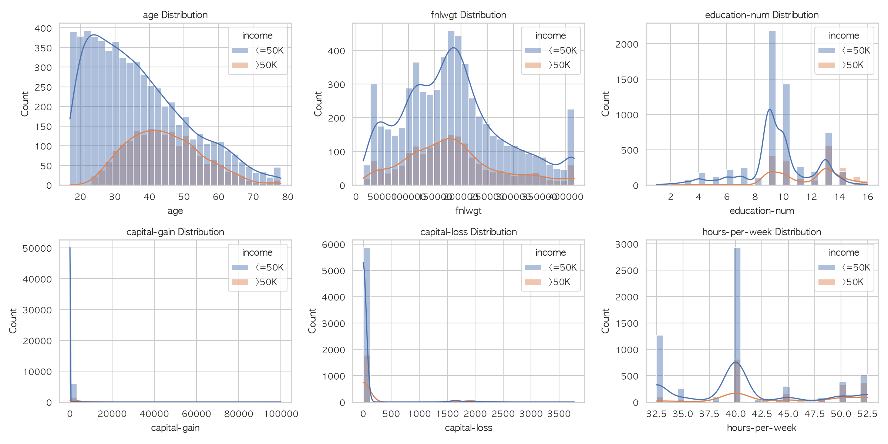
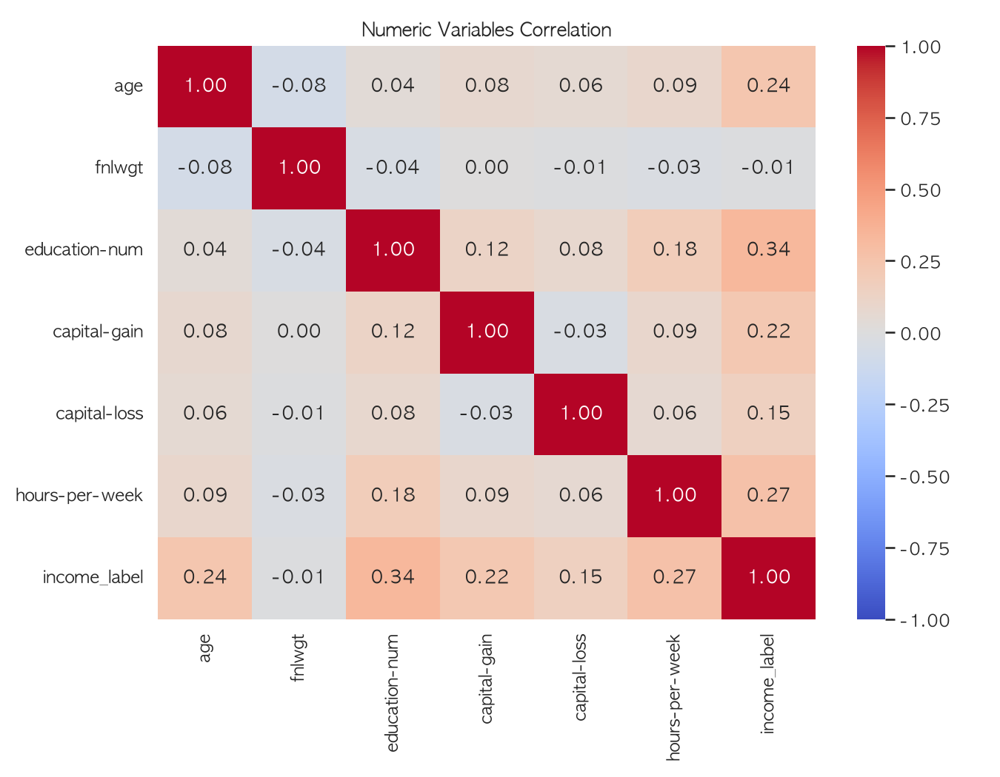
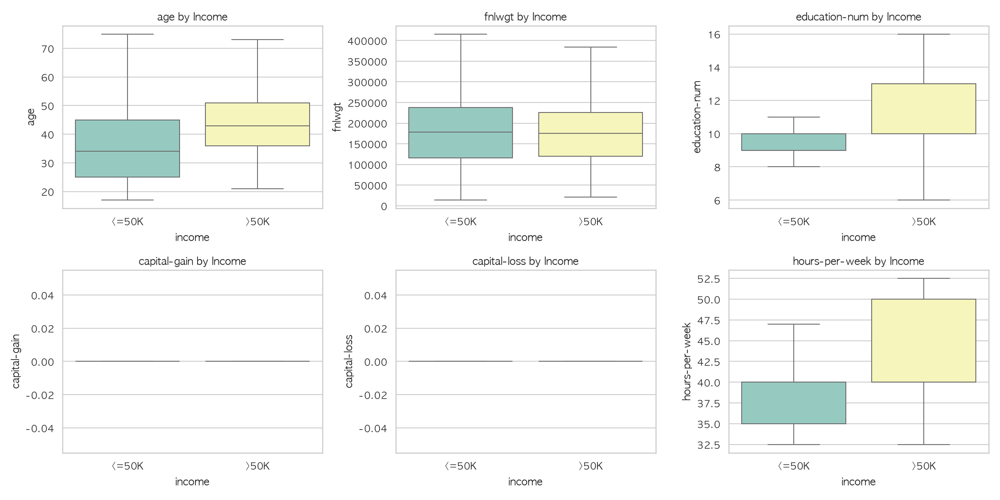

# Day2 종합 실습 - End2End 데이터 분석 프로젝트 결과

## 1. 데이터 개요

- 데이터: UCI Adult Income
- 원본 행 수: 32,561
- 중복 제거 후 행 수: 32,537
- 제거된 중복 행 수: 24
- 목적 변수: `income`

## 2. 데이터 준비 결과

Pandas와 Polars로 데이터를 모두 로딩해 shape 일치 여부를 확인했습니다.

- Pandas shape: (32561, 15)
- Polars shape: (32561, 15)
- shape 일치 여부: True

결측치는 범주형 컬럼에서 발생했으며, 분석에서 행을 삭제하지 않기 위해 `Unknown`으로 대체했습니다.

대체 컬럼:

```text
['workclass', 'occupation', 'native-country']
```

이상치는 `age`, `fnlwgt`, `hours-per-week`에 한해 IQR 기준으로 capping 처리했습니다.

`education-num`은 교육 수준 코드이고, `capital-gain`, `capital-loss`는 0이 많은 사건성 변수라 이상치 제거 대상에서 제외했습니다.

이상치 처리 요약:

| column | lower | upper | outlier_count | method |
| --- | --- | --- | --- | --- |
| age | -2.0 | 78.0 | 142 | IQR capping |
| fnlwgt | -60922.0 | 415742.0 | 993 | IQR capping |
| hours-per-week | 32.5 | 52.5 | 9002 | IQR capping |

## 3. EDA 요약

소득 구간별 건수:

```text
{'<=50K': 24698, '>50K': 7839}
```

소득 구간별 비율:

```text
{'<=50K': 75.91, '>50K': 24.09}
```

Seaborn EDA 차트:



Seaborn 분포 차트:



Seaborn 상관관계 차트:



Seaborn 그룹 비교 차트:



Plotly 인터랙티브 차트:

[교육 수준별 고소득 비율](./assets/plotly_income_by_education.html)

[나이 분포](./assets/plotly_age_distribution.html)

[수치형 변수 상관관계](./assets/plotly_numeric_correlation.html)

교육 수준별 고소득 비율 TOP 5:

| education | high_income_rate | total |
| --- | --- | --- |
| Doctorate | 74.09 | 413 |
| Prof-school | 73.44 | 576 |
| Masters | 55.69 | 1722 |
| Bachelors | 41.49 | 5353 |
| Assoc-voc | 26.12 | 1382 |

## 4. 통계 분석

`income <=50K` 그룹과 `income >50K` 그룹의 `hours-per-week` 평균 차이를 t-test로 검정했습니다.

| 항목 | 값 |
| --- | --- |
| t-statistic | -50.4517 |
| p-value | 0.0 |
| 기준 | p < 0.05 |
| 해석 | 두 소득 그룹의 주당 근무시간 평균 차이는 통계적으로 유의미함 |

수치형 변수와 `income_label`의 상관관계:

| variable | income_label_corr |
| --- | --- |
| education-num | 0.3353 |
| hours-per-week | 0.2711 |
| age | 0.2358 |
| capital-gain | 0.2233 |
| capital-loss | 0.1505 |
| fnlwgt | -0.0084 |

수치형 변수쌍 상관관계 TOP 10:

| variable_a | variable_b | correlation | abs_correlation |
| --- | --- | --- | --- |
| education-num | hours-per-week | 0.1808 | 0.1808 |
| education-num | capital-gain | 0.1227 | 0.1227 |
| age | hours-per-week | 0.0912 | 0.0912 |
| capital-gain | hours-per-week | 0.0899 | 0.0899 |
| education-num | capital-loss | 0.0799 | 0.0799 |
| age | capital-gain | 0.0781 | 0.0781 |
| age | fnlwgt | -0.0772 | 0.0772 |
| capital-loss | hours-per-week | 0.0632 | 0.0632 |
| age | capital-loss | 0.0578 | 0.0578 |
| fnlwgt | education-num | -0.0438 | 0.0438 |

## 5. ML Pipeline 결과

`ColumnTransformer`와 `Pipeline`을 사용해 전처리와 모델 학습을 하나의 객체로 구성했습니다.

| 평가 지표 | 값 |
| --- | --- |
| accuracy | 0.8583 |
| balanced accuracy | 0.78 |
| precision | 0.7436 |
| recall | 0.6288 |
| F1-score | 0.6814 |
| ROC-AUC | 0.9126 |
| 재로딩 후 accuracy | 0.8583 |
| 모델 파일 | `income_pipeline.joblib` |

confusion matrix:

```text
[[4600, 340], [582, 986]]
```

## 6. 발표용 핵심 해석

- Adult Income 데이터는 `<=50K` 클래스가 더 많은 불균형 데이터입니다.
- 교육 수준이 높을수록 `>50K` 비율이 높아지는 경향이 있습니다.
- t-test 결과, 소득 그룹 간 주당 근무시간 평균 차이는 통계적으로 유의미합니다.
- Pipeline 구조로 전처리와 모델을 묶어 재사용성과 저장 가능성을 확보했습니다.

## 7. 아쉬운 점과 추가 개선

아쉬운 점은 첫 모델을 Logistic Regression 하나로만 구성해 다양한 모델 비교까지는 수행하지 못했다는 점입니다.

추가로 더 해볼 수 있는 것은 RandomForest, XGBoost 등 모델 비교, class imbalance 보정, 교차검증, SHAP 기반 변수 중요도 해석입니다.
